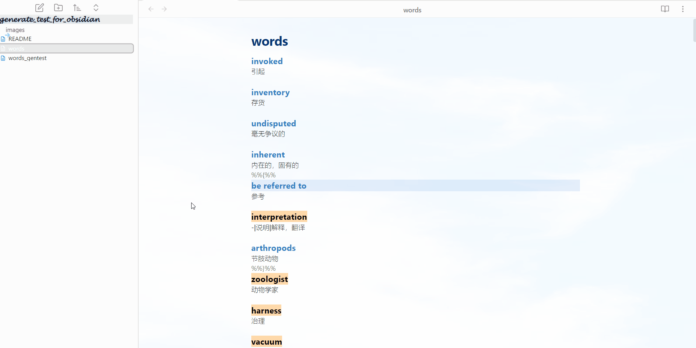
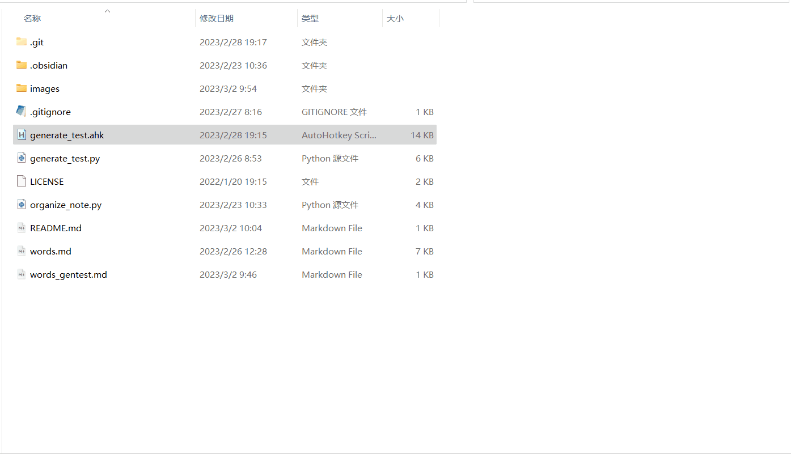
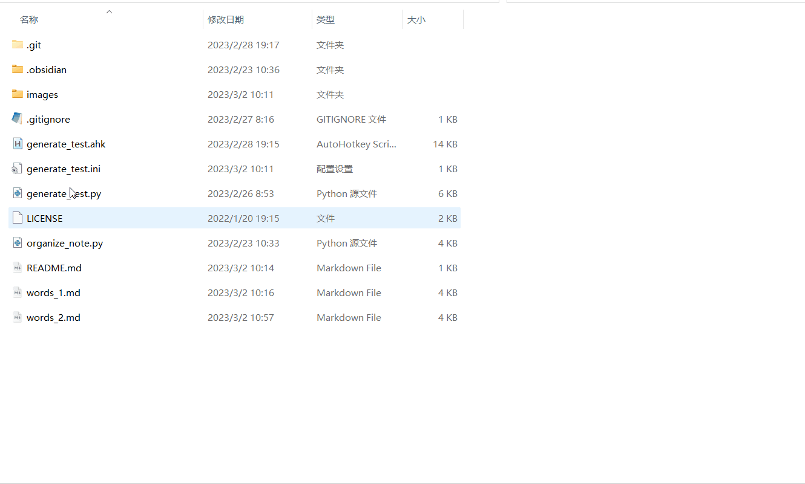
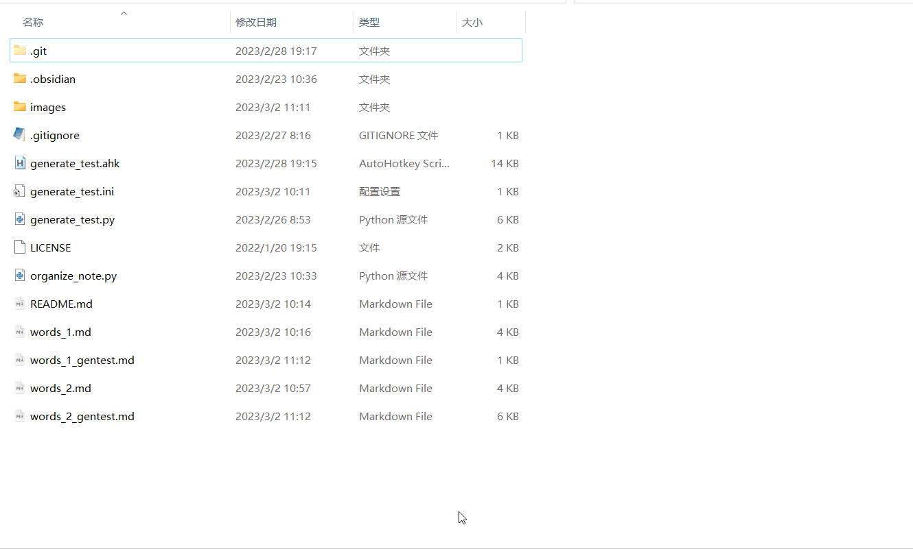
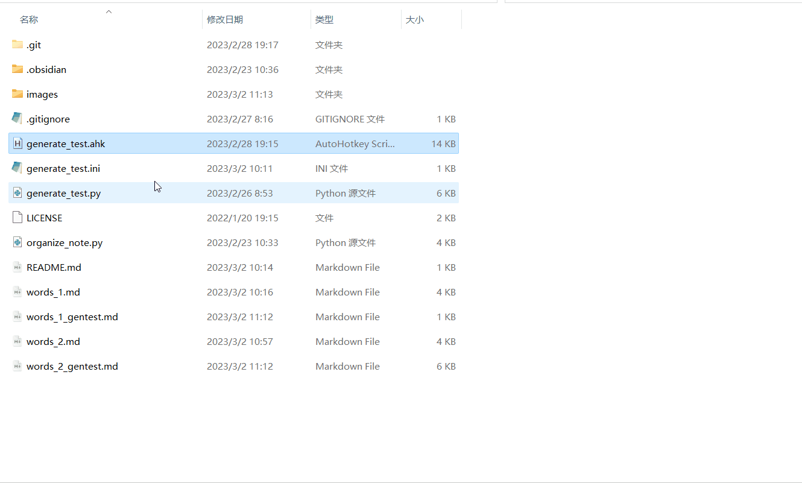

# generate_test_for_obsidian
A script for quickly generating a test form from word notes in Obsidian.

一个在Obsidian中可以快速根据单词笔记生成自我测试用的脚本。

## 原理

利用了Obsidian的[链接](https://help.obsidian.md/Getting+started/Link+notes)功能。

## 效果

### generate_test

使用后根据指定笔记生成一个test文件，阅读模式下鼠标放上去可以看到笔记中的内容。

#### 使用方法

双击打开脚本，第一次使用会弹出一个配置文件生成窗口。保存后会在脚本所在文件夹生成一个配置文件。

脚本开启状态下，选中笔记文件（可多选），使用**Win**和**F1**生成测试笔记，生成的测试笔记会带有_test后缀。**生成时请务必关闭Obsidian等打开了原始文件及原始文件夹的程序。**

脚本开启状态下，使用**Win**和**F2**关闭脚本，或在任务栏图标上右键关闭脚本。

脚本开启状态下，使用**Win**和**F3**重新打开配置文件窗口修改配置文件。

## 计划
- [x] 使用AHK2重构test脚本。

- [ ] 使用AHK2重构organize脚本。
